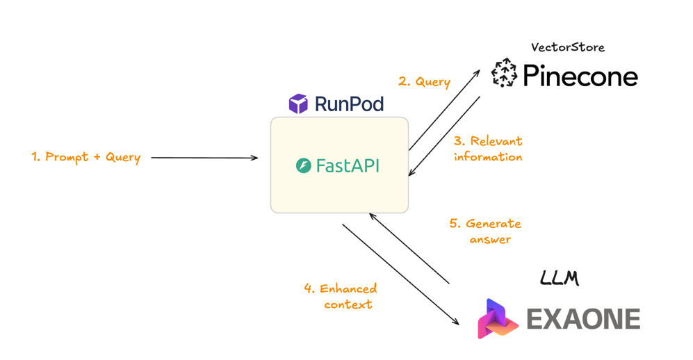

# Building LLM Services Based on Wikipedia(kor) Data

## 개요

이 프로젝트는 Retrieval-Augmented Generation (RAG) 파이프라인을 기반으로 하여,
한국어로 질문을 입력하면 한국어 위키백과(KorQuAD 1.0 train 데이터)를 기반으로 관련 문서를 검색하고,
Huggingface의 오픈소스 LLM을 통해 자연어로 답변을 생성하는 시스템입니다.

*validation 데이터는 추후 langsmith를 활용한 평가를 위해 남겨 두었습니다.*

## 환경 구성

LLM 모델 실행 환경은 [runpod](https://www.runpod.io/)를 사용했습니다.

SSH 접속, NGINX 서버, PyTorch 환경 등이 사전 구성되어 있어,
별도의 클라우드 설정 없이 빠르게 시작할 수 있다는 점이 선택 이유였습니다.

- **Spec**:
    - GPU:1 x RTX A4000
    - CPU: 16 vCPU
    - Memory: 62 GB RAM
    - Disk: 20 GB
    - Pod Volume:  20 GB

## 주요 기능

- **벡터 검색**: Pinecone 기반, 1024차원 Dense Embedding 사용
- **Embedding & LLM 모델** Hugging Face 제공
    - LLM model: `LGAI-EXAONE/EXAONE-3.5-2.4B-Instruct`
    - Embedding model: `nlpai-lab/KURE-v1`
- GPU가 없는 사용자들을 위한 Upstage API 기반 클라우드 모델로도 사용 가능

## 데이터셋

**KorQuAD 1.0**의 학습 데이터를 **Pincone** 에 저장 후, 코사인 유사도 기반으로 검색하도록 구현했습니다.
데이터를 전처리하고 임베딩을 생성하는 로직은 `kor_squad_to_vectorstore.ipynb`에 작성했습니다. 이 노트북을 참고해주세요.

이 데이터셋은 한국어 위키백과에서 추출된 7만 개 이상의 질의응답 쌍으로 구성되어 있습니다.
자세한 정보는 [KorQuAD site](https://korquad.github.io/)를 참고해주세요.

## 프롬프트

프롬프트는 현재 직접 프롬프트를 수정해보기도 했지만, 단순히 `langchain-ai/retrieval-qa-chat`를 사용했을 때,
가장 주관적으로 답변 만족도가 높아 이것을 사용했습니다.  
코드 구현은 이 프롬프트를 `retrieval_chain` 에 연결시켜 최종적으로 `invoke`하도록 했습니다.

이때, **similarity score threshold** 을 설정해서 가지고 있는 문서와 너무 관련이 없는 경우,
tok-k에서 걸러져, (retrieval가 없어) 답변을 제한하게 됩니다.
(하지만, 엄밀하게 말해서 문서 벡터랑 질문 벡터랑 유사도가 낮은 것일 뿐이므로 threshold 값을 굉장히 rough하게 설정했습니다.)

## 아키텍처



## 빠르게 시작하기

- 아래 [환경변수 섹션](#environment-variables)을 참고해서`.env`파일을 구성하세요.
- **Pinecone 벡터 스토어 구성:**
    - `kor_squad_to_vectorstore.ipynb`를 사용해 KorQuAD 데이터를 Pinecone에 저장하세요.
    - 기본 Embedding 모델은 1024차원 벡터를 생성하므로, Pinecone 인덱스도 이에 맞춰 설정해야 합니다!

- **API 로컬 실행**:
    - 아래 커맨드를 실행시켜주세요. (가상환경에서
      실행해주세요..[virtual environment](https://realpython.com/python-virtual-environments-a-primer/))

```bash
git clone https://github.com/why-arong/squad-ko-rag.git
cd squad-ko-rag
```

```bash
pip install -r requirements.txt
uvicorn app.main:app --host {HOST_ADDRESS} --port 4000
```

### Environment Variables

다음 환경 변수들이 필요합니다:

- `PINECONE_API_KEY`: Pinecone API 키
- `UPSTAGE_API_KEY`: *(선택사항)* Upstage 클라우드 모델 사용 시 필요 (로컬 GPU가 없을 경우 유용)

루트 디렉토리에 .env 파일을 생성하고 위 변수들을 정의하세요.

## 사용 방법

API 엔드포인트에 POST 요청을 보내면,
KorQuAD 기반 문서를 기반으로 생성된 답변을 받을 수 있습니다.

이때, **문서와 관련이 없는 질문이 들어온다면 주어진 문서로 답변을 할 수 없다는 응답을 합니다.**

### Example Queries

KorQuAD 문서 내용으로 답변할 수 있는 질문

```shell
curl -X 'POST' \
  '{BASE URL}/query' \
  -H 'accept: application/json' \
  -H 'Content-Type: application/json' \
  -d '{
  "question": "비트겐슈타인이 중위로 복무할 당시 그에게 데이비드 핀센트에 관한 편지를 보낸 이는?"
}'
```

KorQuAD 문서 내용만으로 답변할 수 없는 질문

```shell
curl -X 'POST' \
  '{BASE URL}/query' \
  -H 'accept: application/json' \
  -H 'Content-Type: application/json' \
  -d '{
  "question": "너 내가 누군지 아니?"
}'
```

### 더 발전시켜야 할 사항

- 남겨 놓은 dataset의 validation 쌍을 가지고 langsmith를 이용해 모델 평가
    - 지금은 일부 `langsmith.ipynb`에 구현해 놓음
- Reranker 등 응답 성능 높이기 위한 여러 방법들을 더 도입하면 더 개선할 수 있을 것으로 보임
- 초기에 설계할 때는, Base LLM모델을 abc로 추상화하고 환경변수를 통해
  huggingface와 같은 오픈소스 모델이나 상용 모델을 선택할 수 있도록 구현하려 했으나 시간 상 아직 구현되지 않았음
- 질의 제한을 하는 방법을 단순 프롬프트로 처리하고 있으나, 이를 더 개선할 방법을 찾아야 함
    - Reranker와 유사하게 retriever로 부터 도출된 후보들로부터 인코더 모델 chain을 추가해서, 만약 score가 특정 절대치 이하면 관련 없는 질의로 판단하도록 구현할 수는 있음.
    - 그런데 쿼리마다 값 분포가 달라 절대적인 기준 값을 정할 수가 없어서 일단 구현을 못했음....
    - 아니면 마치 langsmith evaluator 처럼 llm 모델을 하나 더 두어서 문서 내용만으로 답변 가능한 지 평가하도록 할 수도 있겠지만 답변 시간이 2배이상 느려질 것으로 보임..
- 또, 부족한 설명이나 구현의도는 추가적으로 질문주시면 답변하겠습니다.